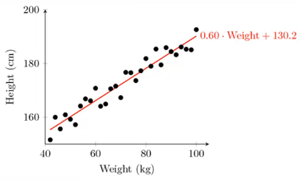

## Lesson 57 Linear Regression using Spark ML

Movie recommendations hard to do with mchine learning as we saw last lesson. This lesson we will go simpler and use linear regression with Spark ML so we can scale this up to a huge dataset.
What is linear regression? It is this idea of fitting a line to a data set of observations. We use this line to predict new unobserved values. We can use this to predict points in the future, past, or anytime. Time has nothing to do with this. 
Example is to create a linear regression line to predct people's height on y axis and weight on x axis. Think of a line like a slash / bottom left to top right. The example is a scatterplot of data points of people's height and weight measured.  We want to find the line that minimizes the error between the distance between each one of those points.



Think simple math formula where the equation of the line is inthe form of a y-intercept and slope formula. In the example we have a slop of 0.6 and a y intercept of 130.2. Plug the weight into the equation and then we can predict the height! To spell it out the formula is: `0.6 * Weight + 130.2 = Height`.

How does it work? Usualy using 'least squares'. IDea is to monimize the squared error between each point and the line. Remember tat the slop intercept equation of a line `y = mx + b`. The slop is the correlation between two variables times the standard deviation in Y all divided by the standard deviation in x. Also the intercept is the mean of Y minus the slpo times the mean of x. 
The slope ends up being the correlation between the two variables times the standard deviation in y divided by the standard deviation in x. 
In the real world we will have mutiple dimensions so things are not that neat. We'll have more than one feature that we are using to predict that label. Ex - predcit someone's height not only on their weight but on their ethnicity or where they live or other correlations. 
Dealing with multi-dimensional variables we need a fancier technique, the way Spark does this is with `stochastic gradient descent (SGD)`. It is friendlier to multi dimensional data as it looks for contours in higher dimensions. This algorithm is ubiquitos in ML as well as in deep learning and neural networks. Just know that Spark utilizes this under the hood for lienar regression!!

Set up the model with the following:
```
lir = LinearRegression(maxIter=10, regParam=0.3, elasticNetParam=0.8)
```
We train the model and make predictions utilizing tuples that consist of a **label** and a **vector of features**. The label is the value we are trying to predict, usually on the y axis and the feature is the x axis. Train with known x y points, predict new y values for given x's using the line the model made, and we can work with >2 dimensions (multiple features).

Be aware of some things. SGD DOES NOT handle `feature scaling` well. It assumes our data is similar to a normal distribution. The normal distribution is like a hill where the highest point is at 0 and the lowest points are at -3 and 3. IF we have multiple features in differnet scales, this will not be able to handle it well. We need to scale our data down and back up again when done. Think this, the scale of peoples weight will be quite different than the scale of peoples age. Also, it assumes our y-intercept is 0 UNLESS we call `.fillIntercept(true)`!!!

We will try this out now. We will fabricate some data for average page speed and revenue generated from session data on an online store. Can we predict the revnue based on page speed using linear model? Again, we want to see if there is a relationship between these two factors, spedning $, speed of page loading.

Looking at `spark-linear-regression.py` file. Code is simple. Most work is in preparding data for use with the model. We first create spark session like usual. 
```
    spark = SparkSession.builder.appName("LinearRegression").getOrCreate()
```
Load up our regression file:
```
    inputLines = spark.sparkContext.textFile("../csv/regression.txt")
```
Note that the data has already been scaled down. The data has been normalzed down to a normal distributions scale. Data has two columns separated by commas `,` with  RDD interface to parse the data out with `.split(",")` function.
```
    data = inputLines.map(lambda x: x.split(",")).map(lambda x: (float(x[0]), Vectors.dense(float(x[1]))))
```
Then we parse x with the lambda function. Remember that x represents each row of the RDD. `.map(lambda x: ...)`> Next, we extract the first column of information with `... (float(x[0])), ...` and then a dense vecotr of the remaining columns `... Vectors.dense(float(x[1])) ...`.
This si the format the linear regression model is expecting. It wants the first column to contain the label, the thing we are predicting, which is `amount spent`! The first column does represent this. Then we have a list of all the features that we are using. We have only one feature which is the `page speed`. 
Note that we could have a dense vectors of multiple features and do a multiple dimension regression easily. Now convert the RDD to a dataframe. 
```
    colNames = ["label", "features"]
    df = data.toDF(colNames)
```
Simply pass inthis column names list into the `.toDF()` function. So we end up with a `label` column that contians that floating point value that represents the `amount spent` and then we will have a features column that contains a dense vector of feature info, in this case it is the single value `page speed`. 

Next step is to split this up into training and testing data. We can do this with Spark's `randomSplit()` function. 
```
    trainTest = df.randomSplit([0.5, 0.5])
    trainingDF = trainTest[0]
    testDF = trainTest[1]
```
Here we are saying to do a fifty-fifty split. So we use half data for training model and half data for testing / evaluating model. The idea is to not train the model with the SAME data we would test it with. That is like cheating on a test.
Extract `trainTest[0]` and `trainTest[1]` into `trainingDF` and `testDF` respectfully.
Then we create our linear regression model. 
```
    lir = LinearRegression(maxIter=10, regParam=0.3, elasticNetParam=0.8)
```
Remember, the work is pretty much in optimizing these hyper parameters. We have reasonable starting values. For best results, try differnet values. 
Next up, train it using the training data frame.
```
    model = lir.fit(trainingDF)
```
Simply call `.fit()` on it and now we have a model that we can use to make predictions! 
Now call `.transform()` passing in our test data and we will cache it so we can do stuff with it.
```
    fullPredictions = model.transform(testDF).cache()
```
Next is to print out. First extract the predictions and labels with `.select()` funciton. Get thnings into an easy format to process by converting back to RDD. Start by selecting prediction column (this is predicted amount spent) and then `.map()` that back to have a single value in it.
Similarly, we'll extract that single value out of the label column. We are just simplifying this down to an easier structure in Python. 
```
    predictions = fullPredictions.select("prediction").rdd.map(lambda x: x[0])
    labels = fullPredictions.select("label").rdd.map(lambda x: x[0])
```
Then we call `.zip()` to zip them together which simply collects together the predicted and actual values for each point. Note that this is not Spark code.
```
    predictionAndLabel = predictions.zip(labels).collect()
```
Now we iterate through each prediction with the zip teogether structure.  Print out, then stop session.
```
    for prediction in predictionAndLabel:
      print(prediction)

    spark.stop()
```

Output:
```
C:\Users\cenzo\SparkCourse\InstructorCode>spark-submit spark-linear-regression.py
(-1.872584479084464, -2.36)
(-1.6040005793921748, -2.26)
(-1.356620671780856, -2.12)
(-1.4060966533031198, -2.09)
(-1.4414366401047367, -2.0)
(-1.4131646506634432, -1.94)
(-1.3495526744205326, -1.88)
(-1.2364647166553582, -1.79)
(-1.1869887351330946, -1.77)
(-1.1657847430521242, -1.65)
(-1.158716745691801, -1.59)
(-1.1163087615298606, -1.57)
(-1.1375127536108307, -1.42)
(-0.946676824882099, -1.4)
(-0.8477248618375715, -1.3)
(-1.05269678528695, -1.29)
(-0.8547928591978948, -1.27)
(-0.8689288539185417, -1.26)
(-0.8618608565582183, -1.25)
(-0.946676824882099, -1.25)
(-0.8547928591978948, -1.23)
(-0.8618608565582183, -1.22)
(-0.8901328459995119, -1.17)
(-0.8972008433598353, -1.17)
(-0.6639569304691633, -1.1)
(-0.8477248618375715, -1.09)
(-0.8053168776756312, -1.08)
(-0.8406568644772481, -1.04)
(-0.6144809489468994, -1.03)
(-0.6639569304691633, -1.01)
(-0.784112885594661, -0.99)
(-0.6568889331088398, -0.97)
(-0.6922289199104568, -0.97)
(-0.7629088935136907, -0.96)
(-0.5862089595056059, -0.95)
(-0.7205009093517504, -0.94)
(-0.7346369040723971, -0.94)
(-0.6851609225501334, -0.92)
(-0.6568889331088398, -0.91)
(-0.7417049014327206, -0.91)
(-0.5579369700643123, -0.88)
(-0.6286169436675463, -0.87)
(-0.642752938388193, -0.81)
(-0.5296649806230187, -0.8)
(-0.5791409621452824, -0.8)
(-0.5862089595056059, -0.78)
(-0.48018899910075485, -0.76)
(-0.607412951586576, -0.76)
(-0.4024410281371975, -0.71)
(-0.5438009753436654, -0.7)
(-0.5367329779833421, -0.69)
(-0.5508689727039888, -0.68)
(-0.39537303077687413, -0.65)
(-0.46605300438010805, -0.65)
(-0.4731210017404315, -0.65)
(-0.44484901229913787, -0.63)
(-0.49432499382140166, -0.62)
(-0.43071301757849106, -0.61)
(-0.48018899910075485, -0.59)
(-0.39537303077687413, -0.57)
(-0.38123703605622733, -0.54)
(-0.3671010413355805, -0.53)
(-0.3741690386959039, -0.53)
(-0.5013929911817251, -0.52)
(-0.26108108093072957, -0.5)
(-0.40950902549752094, -0.5)
(-0.2752170756513764, -0.49)
(-0.32469305717364016, -0.49)
(-0.46605300438010805, -0.46)
(-0.23987708884975942, -0.45)
(-0.33176105453396354, -0.42)
(-0.28228507301169975, -0.39)
(-0.30348906509266993, -0.36)
(-0.40950902549752094, -0.36)
(-0.19746910468781906, -0.35)
(-0.34589704925461034, -0.35)
(-0.22574109412911264, -0.33)
(-0.26108108093072957, -0.3)
(-0.31055706245299336, -0.3)
(-0.1267891310845851, -0.27)
(-0.0914491442829681, -0.26)
(-0.16919711524652548, -0.25)
(-0.21160509940846586, -0.25)
(-0.18333310996717225, -0.24)
(-0.21867309676878924, -0.24)
(-0.18333310996717225, -0.23)
(-0.21867309676878924, -0.23)
(-0.21867309676878924, -0.22)
(-0.268149078291053, -0.21)
(-0.32469305717364016, -0.19)
(-0.1126531363639383, -0.18)
(-0.1126531363639383, -0.16)
(-0.1267891310845851, -0.16)
(-0.02783716804005754, -0.14)
(-0.07731314956232131, -0.13)
(-0.0914491442829681, -0.11)
(-0.020769170679734144, -0.1)
(-0.0914491442829681, -0.1)
(-0.1055851390036149, -0.1)
(-0.1267891310845851, -0.09)
(-0.1126531363639383, -0.08)
(-0.006633175959087353, -0.07)
(-0.05610915748135112, -0.07)
(-0.16919711524652548, -0.07)
(0.0004348214012360428, -0.05)
(-0.1409251258052319, -0.05)
(0.0781827923647934, -0.04)
(-0.1055851390036149, -0.03)
(0.04284280556317642, -0.02)
(0.014570816121882834, -0.01)
(0.03577480820285303, 0.0)
(0.028706810842529625, 0.0)
(-0.03490516540038094, -0.0)
(-0.020769170679734144, 0.02)
(0.014570816121882834, 0.03)
(0.03577480820285303, 0.07)
(-0.07731314956232131, 0.07)
(0.05697880028382321, 0.08)
(0.028706810842529625, 0.08)
(-0.020769170679734144, 0.08)
(0.09938678444576358, 0.09)
(0.06404679764414661, 0.09)
(0.014570816121882834, 0.09)
(0.0004348214012360428, 0.09)
(-0.020769170679734144, 0.09)
(-0.02783716804005754, 0.1)
(0.04991080292349982, 0.11)
(0.03577480820285303, 0.11)
(-0.04904116012102773, 0.11)
(0.14886276596802736, 0.12)
(0.06404679764414661, 0.14)
(0.23367873429190808, 0.15)
(0.12765877388705715, 0.15)
(0.12765877388705715, 0.16)
(0.028706810842529625, 0.16)
(0.2548827263728783, 0.17)
(0.04991080292349982, 0.17)
(0.11352277916641039, 0.18)
(0.14886276596802736, 0.21)
(0.14886276596802736, 0.21)
(0.11352277916641039, 0.21)
(0.20540674485061453, 0.22)
(0.19833874749029112, 0.23)
(0.15593076332835074, 0.23)
(0.0923187870854402, 0.24)
(0.2266107369315847, 0.26)
(0.18420275276964435, 0.26)
(0.12765877388705715, 0.26)
(0.3043587078951421, 0.3)
(0.2407467316522315, 0.3)
(0.19833874749029112, 0.32)
(0.2407467316522315, 0.34)
(0.2266107369315847, 0.35)
(0.2407467316522315, 0.37)
(0.2195427395712613, 0.37)
(0.2831547158141719, 0.39)
(0.19127075012996772, 0.39)
(0.3043587078951421, 0.4)
(0.2407467316522315, 0.4)
(0.27608671845384847, 0.41)
(0.2902227131744953, 0.42)
(0.3184947026157889, 0.43)
(0.24781472901255489, 0.44)
(0.2831547158141719, 0.45)
(0.2972907105348187, 0.49)
(0.24781472901255489, 0.49)
(0.42451466302063984, 0.5)
(0.32556269997611226, 0.5)
(0.3821066788586995, 0.53)
(0.3184947026157889, 0.53)
(0.2831547158141719, 0.54)
(0.4669226471825802, 0.55)
(0.3891746762190228, 0.58)
(0.47399064454290357, 0.61)
(0.32556269997611226, 0.61)
(0.3821066788586995, 0.63)
(0.42451466302063984, 0.64)
(0.5022626339841971, 0.67)
(0.4386506577412866, 0.68)
(0.5022626339841971, 0.69)
(0.4315826603809632, 0.69)
(0.6153505917493715, 0.7)
(0.5870786023080778, 0.71)
(0.5305346234254907, 0.71)
(0.6294865864700182, 0.72)
(0.5588066128667843, 0.72)
(0.5588066128667843, 0.72)
(0.4527866524619334, 0.74)
(0.4386506577412866, 0.74)
(0.6365545838303417, 0.75)
(0.5446706181461375, 0.78)
(0.4951946366238738, 0.79)
(0.4669226471825802, 0.79)
(0.4951946366238738, 0.81)
(0.5588066128667843, 0.83)
(0.5446706181461375, 0.85)
(0.6082825943890481, 0.87)
(0.6436225811906651, 0.9)
(0.6648265732716352, 0.93)
(0.6082825943890481, 0.94)
(0.7001665600732522, 0.95)
(0.5446706181461375, 0.95)
(0.5800106049477545, 0.96)
(0.6365545838303417, 0.97)
(0.6153505917493715, 0.97)
(0.6294865864700182, 0.98)
(0.6506905785509884, 0.99)
(0.6718945706319586, 1.01)
(0.6224185891096948, 1.03)
(0.5517386155064609, 1.05)
(0.7708465336764863, 1.06)
(0.7284385495145458, 1.06)
(0.7355065468748692, 1.07)
(0.749642541595516, 1.08)
(0.8980704861623073, 1.11)
(0.8344585099193967, 1.11)
(0.7637785363161628, 1.12)
(0.8415265072797201, 1.14)
(0.9970224492068347, 1.15)
(0.8485945046400435, 1.16)
(0.8980704861623073, 1.18)
(0.8415265072797201, 1.19)
(0.7991185231177796, 1.2)
(0.8203225151987499, 1.24)
(0.7708465336764863, 1.27)
(0.8839344914416605, 1.28)
(0.8768664940813371, 1.28)
(1.0394304333687752, 1.32)
(0.9828864544861879, 1.37)
(1.0323624360084518, 1.39)
(0.8415265072797201, 1.41)
(0.9122064808829541, 1.42)
(1.0394304333687752, 1.48)
(1.0111584439274817, 1.49)
(1.124246401692656, 1.5)
(1.1171784043323325, 1.5)
(1.124246401692656, 1.51)
(1.0959744122513624, 1.51)
(1.053566428089422, 1.52)
(1.0677024228100689, 1.54)
(1.0394304333687752, 1.54)
(1.2585383515388004, 1.62)
(1.0464984307290985, 1.63)
(1.0464984307290985, 1.64)
(1.1666543858545964, 1.66)
(1.322150327781711, 1.72)
(1.251470354178477, 1.8)
(1.2797423436197708, 1.91)
(1.498850261789796, 2.09)
(1.4140342934659151, 2.17)
(1.61193821955497, 2.31)
(1.5059182591501192, 2.33)
(1.6826181931582043, 2.39)
(1.7745021588424081, 2.48)
(1.8239781403646722, 2.56)
(-2.4450922652706586, -3.54)
(-2.3178683127848374, -3.23)
(-2.056352410452872, -2.89)
(-1.837244492282847, -2.6)
(-1.7382925292383193, -2.45)
(-1.6676125556350854, -2.43)
(-1.3919606585824729, -2.06)
(-1.4414366401047367, -2.0)
(-1.497980618987324, -1.98)
(-1.3919606585824729, -1.91)
(-1.356620671780856, -1.84)
(-1.123376758890184, -1.68)
(-1.2223287219347114, -1.68)
(-1.2506007113760051, -1.68)
(-1.2223287219347114, -1.66)
(-1.1304447562505073, -1.63)
(-1.1021727668092138, -1.6)
(-1.179920737772771, -1.58)
(-1.0244247958456563, -1.57)
(-1.1516487483314777, -1.54)
(-1.0032208037646861, -1.5)
(-1.0880367720885669, -1.45)
(-1.0597647826472734, -1.42)
(-0.8830648486391884, -1.41)
(-1.0456287879266266, -1.4)
(-0.9678808169630693, -1.37)
(-0.9820168116837161, -1.36)
(-0.8547928591978948, -1.35)
(-0.9537448222424225, -1.34)
(-0.8830648486391884, -1.25)
(-0.9396088275217757, -1.2)
(-0.9749488143233926, -1.2)
(-0.8053168776756312, -1.17)
(-0.6992969172707801, -1.16)
(-0.8053168776756312, -1.16)
(-0.9254728328011289, -1.15)
(-0.7699768908740142, -1.1)
(-0.8477248618375715, -1.08)
(-0.6356849410278697, -1.03)
(-0.607412951586576, -1.01)
(-0.7770448882343376, -1.01)
(-0.8406568644772481, -1.01)
(-0.6286169436675463, -1.0)
(-0.7205009093517504, -1.0)
(-0.7770448882343376, -0.99)
(-0.748772898793044, -0.98)
(-0.5720729647849591, -0.97)
(-0.6922289199104568, -0.95)
(-0.5791409621452824, -0.93)
(-0.6568889331088398, -0.93)
(-0.7346369040723971, -0.92)
(-0.5155289859023718, -0.91)
(-0.6215489463072228, -0.91)
(-0.5650049674246357, -0.9)
(-0.6144809489468994, -0.85)
(-0.748772898793044, -0.82)
(-0.5296649806230187, -0.81)
(-0.6215489463072228, -0.81)
(-0.5791409621452824, -0.8)
(-0.5932769568659292, -0.79)
(-0.6851609225501334, -0.79)
(-0.67809292518981, -0.78)
(-0.6851609225501334, -0.78)
(-0.6286169436675463, -0.76)
(-0.49432499382140166, -0.74)
(-0.39537303077687413, -0.73)
(-0.4589850070197847, -0.73)
(-0.4872569964610783, -0.73)
(-0.5367329779833421, -0.73)
(-0.43071301757849106, -0.72)
(-0.4872569964610783, -0.72)
(-0.607412951586576, -0.72)
(-0.4519170096594613, -0.71)
(-0.5508689727039888, -0.7)
(-0.4519170096594613, -0.64)
(-0.4377810149388145, -0.62)
(-0.39537303077687413, -0.59)
(-0.5579369700643123, -0.58)
(-0.30348906509266993, -0.56)
(-0.5650049674246357, -0.56)
(-0.40950902549752094, -0.52)
(-0.2540130835704062, -0.48)
(-0.41657702285784426, -0.48)
(-0.34589704925461034, -0.47)
(-0.33176105453396354, -0.44)
(-0.36003304397525715, -0.42)
(-0.20453710204814246, -0.41)
(-0.23987708884975942, -0.41)
(-0.30348906509266993, -0.41)
(-0.16919711524652548, -0.4)
(-0.22574109412911264, -0.4)
(-0.2752170756513764, -0.4)
(-0.33882905189428697, -0.4)
(-0.1338571284449085, -0.38)
(-0.2752170756513764, -0.37)
(-0.44484901229913787, -0.37)
(-0.3529650466149337, -0.36)
(-0.19040110732749566, -0.35)
(-0.29642106773234655, -0.35)
(-0.23987708884975942, -0.34)
(-0.19040110732749566, -0.33)
(-0.19040110732749566, -0.32)
(-0.19746910468781906, -0.31)
(-0.21160509940846586, -0.3)
(-0.29642106773234655, -0.3)
(-0.30348906509266993, -0.29)
(-0.24694508621008282, -0.28)
(-0.2893530703720232, -0.25)
(-0.23987708884975942, -0.21)
(-0.24694508621008282, -0.21)
(-0.05610915748135112, -0.2)
(-0.21160509940846586, -0.2)
(-0.1267891310845851, -0.19)
(-0.1267891310845851, -0.19)
(-0.16212911788620207, -0.19)
(-0.0843811469226447, -0.18)
(-0.06317715484167452, -0.17)
(-0.02783716804005754, -0.16)
(-0.1409251258052319, -0.15)
(-0.16919711524652548, -0.14)
(-0.04197316276070433, -0.11)
(-0.11972113372426169, -0.11)
(-0.20453710204814246, -0.11)
(-0.0843811469226447, -0.1)
(-0.020769170679734144, -0.09)
(-0.02783716804005754, -0.07)
(-0.06317715484167452, -0.07)
(0.0004348214012360428, -0.06)
(-0.02783716804005754, -0.05)
(-0.07731314956232131, -0.05)
(-0.17626511260684888, -0.04)
(0.06404679764414661, -0.02)
(-0.006633175959087353, -0.02)
(-0.07731314956232131, -0.01)
(0.05697880028382321, -0.0)
(0.05697880028382321, 0.03)
(0.09938678444576358, 0.05)
(-0.013701173319410748, 0.05)
(0.11352277916641039, 0.06)
(0.08525078972511681, 0.06)
(0.12059077652673376, 0.08)
(0.04284280556317642, 0.08)
(0.08525078972511681, 0.09)
(0.07111479500447, 0.1)
(-0.15506112052587867, 0.1)
(0.08525078972511681, 0.11)
(-0.006633175959087353, 0.11)
(-0.020769170679734144, 0.12)
(0.03577480820285303, 0.13)
(0.04284280556317642, 0.14)
(0.17713475540932094, 0.15)
(0.20540674485061453, 0.16)
(0.14179476860770396, 0.19)
(0.04991080292349982, 0.19)
(0.2407467316522315, 0.21)
(0.19833874749029112, 0.24)
(0.14179476860770396, 0.24)
(0.15593076332835074, 0.25)
(0.12059077652673376, 0.25)
(0.20540674485061453, 0.26)
(0.17713475540932094, 0.29)
(0.14886276596802736, 0.29)
(0.20540674485061453, 0.31)
(0.2548827263728783, 0.32)
(0.12765877388705715, 0.32)
(0.17713475540932094, 0.34)
(0.33969869469675906, 0.35)
(0.35383468941740587, 0.38)
(0.2619507237332017, 0.38)
(0.34676669205708244, 0.4)
(0.3114267052554655, 0.4)
(0.37503868149837605, 0.41)
(0.44571865510161, 0.45)
(0.3821066788586995, 0.45)
(0.35383468941740587, 0.45)
(0.3962426735793462, 0.48)
(0.3043587078951421, 0.49)
(0.44571865510161, 0.5)
(0.32556269997611226, 0.55)
(0.2195427395712613, 0.55)
(0.3962426735793462, 0.56)
(0.2619507237332017, 0.56)
(0.5163986287048439, 0.61)
(0.3821066788586995, 0.61)
(0.48105864190322695, 0.63)
(0.44571865510161, 0.63)
(0.32556269997611226, 0.64)
(0.4386506577412866, 0.65)
(0.5517386155064609, 0.67)
(0.4174466656603164, 0.68)
(0.6012145970287247, 0.69)
(0.5376026207858141, 0.72)
(0.5517386155064609, 0.73)
(0.48105864190322695, 0.73)
(0.5376026207858141, 0.74)
(0.5093306313445205, 0.77)
(0.5588066128667843, 0.78)
(0.5517386155064609, 0.78)
(0.5588066128667843, 0.81)
(0.5093306313445205, 0.85)
(0.6648265732716352, 0.86)
(0.5517386155064609, 0.88)
(0.5729426075874311, 0.89)
(0.6365545838303417, 0.9)
(0.6577585759113118, 0.91)
(0.6648265732716352, 0.93)
(0.7213705521542224, 0.95)
(0.6577585759113118, 0.95)
(0.5941465996684012, 0.95)
(0.7284385495145458, 0.96)
(0.7355065468748692, 0.98)
(0.6930985627129288, 0.99)
(0.749642541595516, 1.0)
(0.6224185891096948, 1.01)
(0.7284385495145458, 1.02)
(0.6082825943890481, 1.05)
(0.7284385495145458, 1.09)
(0.6577585759113118, 1.1)
(0.8697984967210137, 1.13)
(0.7355065468748692, 1.14)
(0.7284385495145458, 1.16)
(0.9758184571258646, 1.17)
(0.8273905125590733, 1.19)
(0.7779145310368096, 1.19)
(0.8344585099193967, 1.2)
(0.926342475603601, 1.25)
(0.8344585099193967, 1.27)
(0.8344585099193967, 1.28)
(0.9970224492068347, 1.29)
(0.926342475603601, 1.31)
(1.018226441287805, 1.36)
(0.926342475603601, 1.38)
(1.1101104069720091, 1.4)
(1.0747704201703923, 1.53)
(1.0111584439274817, 1.53)
(1.1171784043323325, 1.54)
(1.1313143990529795, 1.56)
(1.1030424096116858, 1.59)
(1.0959744122513624, 1.65)
(1.088906414891039, 1.74)
(1.0606344254497453, 1.74)
(1.2090623700165366, 1.76)
(1.2373343594578303, 1.78)
(1.180790380575243, 1.8)
(1.2868103409800942, 1.82)
(1.230266362097507, 1.82)
(1.1949263752958899, 1.82)
(1.3080143330610643, 1.86)
(1.4705782723485024, 1.95)
(1.2938783383404175, 2.0)
(1.626074214275617, 2.27)
(1.8875901166075826, 2.62)
(1.7603661641217614, 2.67)
(2.0360180611743743, 2.71)
(1.96533808757114, 2.76)
```
What we see here is the predicted value, actual value for everything in our test data set. In other words, for every test point, this is the value we predicted. By eyeballing this you can see it is okay. Ex - we predicted amount spent in one area is 2.036... when the actual spent was 2.71. Was pretty off. Same ballpark though. Accuracy can be improved either by adjusting hyper parameters or throwing more data at it. 
Will def get better results by using real world data instead of data that are generated more or less at random. Still easy to use again its just tough to prepare the data.